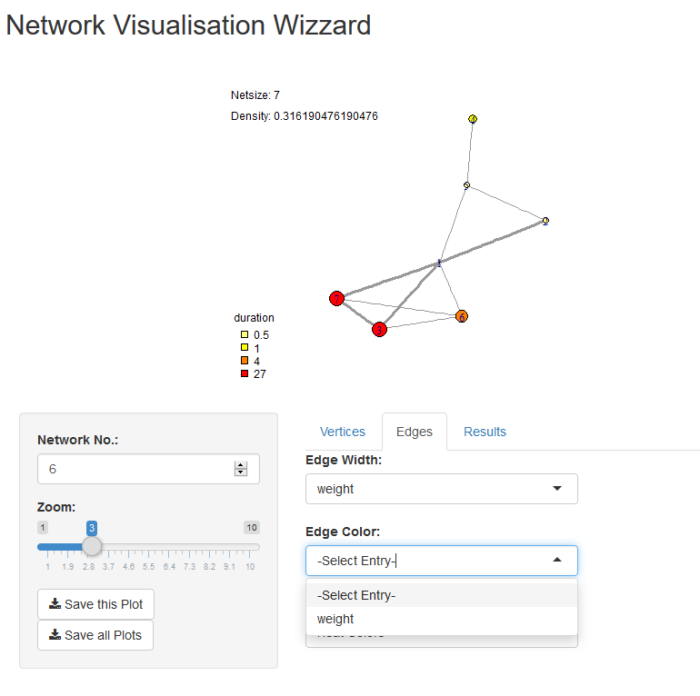
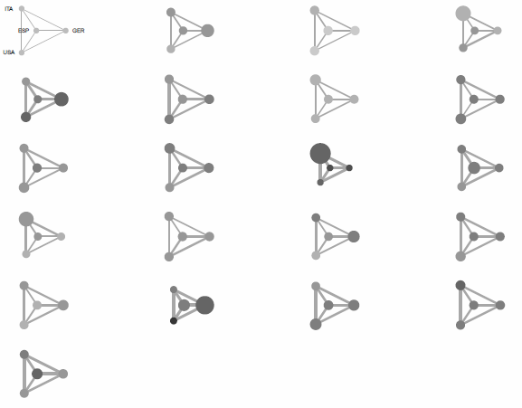

egonetR is a package in R for importing, analyzing and visualizing ego-centered network data. Ego-centered networks are here understood as the network of a focal actor (ego), including the relationships of ego to alters and the relationships between these alters (also called ego-centric networks or personal networks). The intention of egonetR is to enable users to conduct ego-centered network analysis with very basic R programming knowledge.

What is egonetR developed for?
-------
- Import and data handling: Loading data from different formats to R and generating a so called egoR object which facilitates the handling of different data formats. Ego-centered network data can – depending on the software or approach you choose during data collection – be stored in different ways (see different data formats). EgonetR allows to load data from different source formats, without manipulating the source data structure (e.g. from the so called “one file”, “two files” or “folders” format; find more information on this [here](http://tilltnet.github.io/egonetR/downloads/egonetR_Formats_Import.pdf). (If you are not familiar with the different data structures in R, you can learn about it in this [short introduction ](http://tilltnet.github.io/egonetR/downloads/01_basics.html).)
- Data analysis: ego-centered network analysis is commonly conducted on two different level. On the alter level the analysis focusses on the qualities of the ego-alter-relationships; on the network level analysis focuses the structure and composition of the ego-centered network. For both levels egonetR allows to calculate a range of network measures.
    - On alter level: multiplexity, homophily
    - On network level: size, density, EI-Index, diversity, components, proportions of ties with specific attributes.
- By providing the egoR object encompassing the different data formats, egonetR allows a quick use in additional R packages e.g. to typologyze ego-networks (cluster analysis), perform different kinds of regression analysis (dependent variable on alter or network level). 
- Visualization: egonetR supports visual analysis of ego-centered networks in two ways. Via the so called visualization wizard and the so called clustered graphs. 
- Visualization wizard: This function opens a browser and allows to visualize all networks along alter-level, ego-level, network-level information.
- Clustered graphs: egonetR has built in the function to generate so called clustered graphs to cluster, aggregate, and visualize collections of ego-centered networks along structural and compositional properties as developed by Lerner et al. (2008).

Installation of R, R-Studio and egonetR
----------------------------
1. Installation of R can be done from http://cran.r-project.org/
2. Installation of a graphical user interface such as R-Studio via www.rstudio.com (optional, but recommended)
3. Installation of egonetR:

    - [Download](https://github.com/tilltnet/egonetR/releases) latest release and install manually
    - Install [Development Version](devel_install.html)

## Basic functionality
Find basic functionality listed below.

### The import functions
Depending on how your source data look like (“one file”, “two filed”, “folders” format; find a more detailed explanation here [hier deine ppt aus dem Kurs hinterlegen zu den formaten]) you will choose one of these functions to load ego-centered network data and generate the egoR object. 

`read.egonet.one.file(egos, netsize, egoID = "egoID", attr.start.col, attr.end.col, dy.max.alteri, dy.first.var, ego.vars = NULL, var.wise = F)`

`read.egonet.two.files(egos, alteri, netsize = NULL, egoID = "egoID",  alterID = NULL, e.max.alteri, e.first.var, ego.vars = NULL,  selection = NULL)`

`read.egonet.folders(egos.file, alter.folder, edge.folder, csv.sep = ",",egoID = "egoID", first.col.row.names = FALSE)`

EgoR object is a list of six objects: 
1. egos.df: dataframe of all egos and their attributes
2. alteri.df: dataframe of all alteri
3. alteri.list: list of dataframes of all alteri per ego
4. edges: list of dataframes with edge lists per network
5. graphs: list of igraph objects
6. results: a result dataframe, pre-populated with the network size of each network

### Analysis
EgonetR allows to calculate a range of network measures, e.g.:
- density: egoR.density(egoR, weight = "weight", max.netsize = NULL) 
- compositional measures for ego-centered-network data (diversity, EI-Index): composition(alteri, v_alt, netsize, egoID = "egoID", v_ego = NULL, mode = "regular")

### Visualization
- Visualisation Wizzard: vis.wizzard()

- Clustered graphs: clustered.graphs(alteri.list, edges.list, clust.groups)

## Workhshops with egonetR
egonetR is regularily (introd)used in workshops. Please find a list of past and upcoming events below: 

### Future Workshops 
- 01.06 - 03.06.2016: Erhebung und Analyse egozentrierter Netzwerke, GESIS/ Köln (Till Krenz, Andreas Herz, Markus Gamper, Sören Petermann)
- 14.06.2016: Simplifying ego-centered network analysis in R with egonetR, EUSN, Paris (Till Krenz, Andreas Herz)
- 12-17/9/2016: 10th Trierer Summerschool on Social Network Analysis (Trier/ Germany), (Till Krenz)

### Past Workshops 
- 22.4.2016: Einführung in die ego-zentrierte Netzwerkanalyse mit R in egonetR, TU Braunschweig, Braunschweig (Till Krenz, Andreas Herz)
- 5. – 6/4/2016: Simplifying ego-centered network analysis in R with egonetR (XXXVI Sunbelt Conference of the International Network for Social Network Analysis (INSNA) Newport Beach, California (Till Krenz/ Andreas Herz)
- 8. – 9/1/2016: Einführung in die ego-zentrierte Netzwerkanalyse, NRW Fortschrittskolleg Online-Partizipation, Universität Düsseldorf (Andreas Herz/ Markus Gamper)
- 26/11-27/11/2015: Analysis of ego-centered networks. Insitut für Soziologie. TU Chemnitz (Till Krenz/ Andreas Herz)
- 21-26/9/2015: 9th Trierer Summerschool on Social Network Analysis (Trier/ Germany), (Till Krenz)
- 23/6/2015: Advanced ego-network analysis with R (XXXV Sunbelt Conference of the International Network for Social Network Analysis (INSNA)/ Brighton) (Till Krenz/ Andreas Herz)

